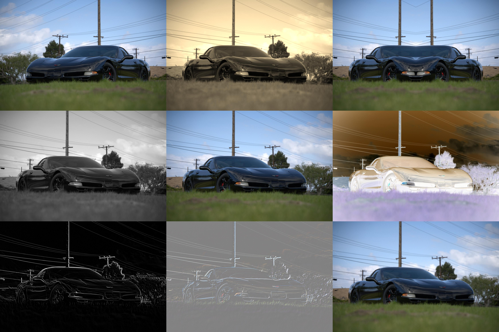

# Image Collage Generator

A manual, predefined image manipulation program to test different image manipulation algorithms.

It performs a mirror, a sepia, a split, a grayscale, a normal draw, an inversion, an edge detection, an emboss, and a gaussian blur.



### Usage

```
usage: Image Collage Generator [-h] [-k KERNEL_SIZE] [-i INPUT_SIZE] [-o OUTPUT_FILE] input

positional arguments:
  input                 file to process

options:
  -h, --help            show this help message and exit
  -k KERNEL_SIZE, --kernel-size KERNEL_SIZE
                        kernel size to use for gaussian blur and edge detect.
  -i INPUT_SIZE, --input-size INPUT_SIZE
                        size to scale images to before processing (width)
  -o OUTPUT_FILE, --output-file OUTPUT_FILE
                        file to write collage to
```
